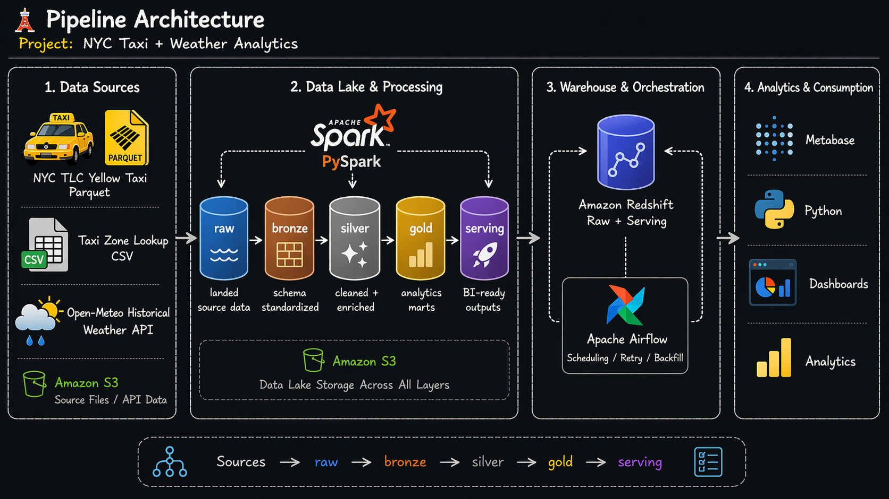
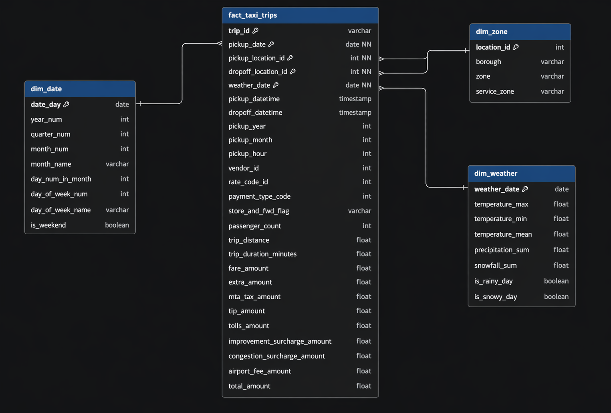
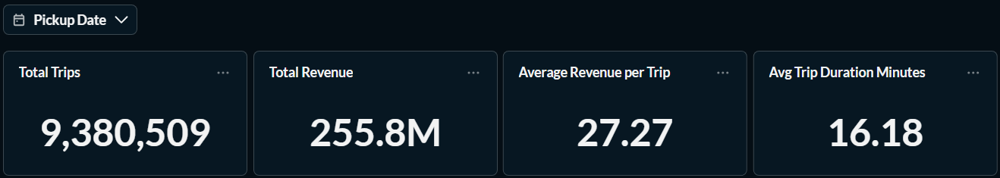
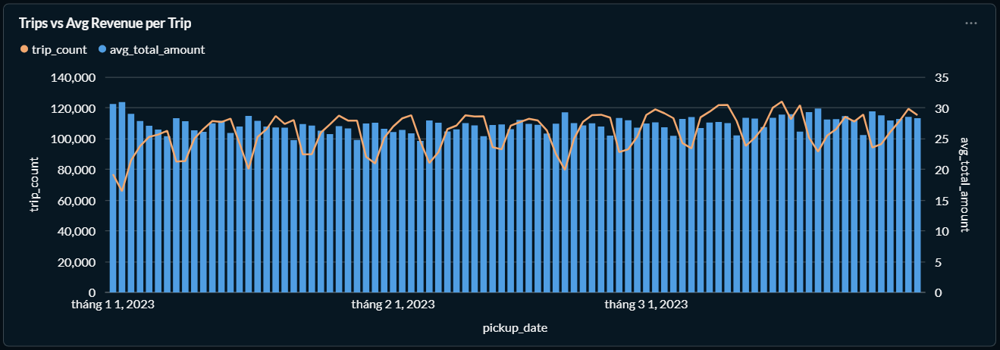
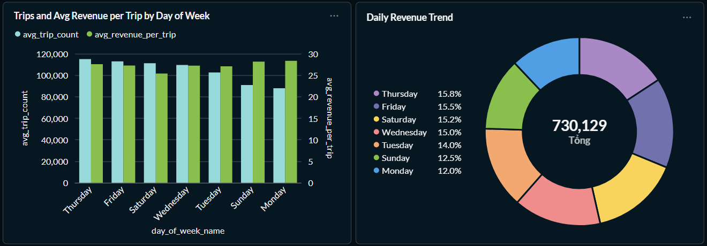
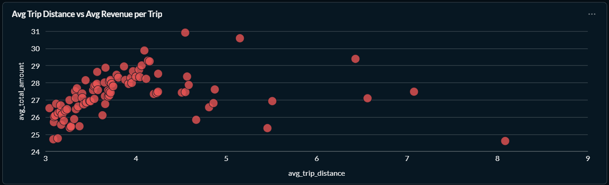
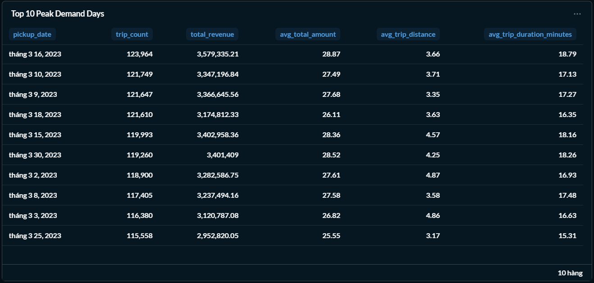

# 🏗️ Data Warehouse & Mart Build: Production ETL Pipeline

An end-to-end data engineering pipeline that transforms raw APIs from NYC TLC Yellow Taxi Parquet, TLC Taxi Zone Lookup CSV and Open-Mateo Historical Weather API into a normalized star schema data warehouse, then builds analytical data marts.



---

## 🧾 Executive Summary (For Hiring Managers)

- ✅ **Pipeline scope:** Built a complete **ETL pipeline** from raw APIs to star schema warehouse to analytical marts  
- ✅ **Data modeling:** Designed a **star schema** with fact tables, dimensions, and bridge tables for many-to-many relationships  
- ✅ **ETL development:** Implemented **extract, transform, load** processes with idempotent operations and data quality checks  
- ✅ **Mart architecture:** Created **specialized data marts** with additive measures and incremental update patterns

---

## 🧩 Problem & Context

Raw NYC taxi trip data, taxi zone lookup data, and daily weather data come from separate sources — NYC TLC Yellow Taxi Parquet, TLC Taxi Zone Lookup CSV, and the Open-Meteo Historical Weather API — and are not ready for direct analytical use. Analysts need to answer:

- How does taxi demand change over time?
- Which zones generate the most trips and revenue?
- How do payment patterns vary by day and trip behavior?
- How does weather affect trip volume and revenue?

**Challenge:** Data teams need a single source of truth for taxi analytics because the raw data arrives at different grains (`trip`, `zone`, `date`), requires cleaning and enrichment, and is not structured for reliable BI queries or dashboarding. A layered pipeline is needed to standardize, validate, and transform the data into business-ready outputs.

**Solution:** Build an end-to-end Spark-based analytics pipeline that ingests data from APIs and source files, lands it in `raw`, transforms it through `bronze -> silver -> gold`, and publishes curated `serving` tables for downstream BI and dashboard use cases such as demand trend analysis, payment mix analysis, and weather impact analysis.

---

## 🧰 Tech Stack

- ☁️ **Storage**: Amazon S3 for raw landing and intermediate data storage
- 🐍 **Language**: Python for ingestion, validation, export, and pipeline scripting
- ⚡ **Processing Engine**: Apache Spark / PySpark for `raw -> bronze -> silver -> gold` transformations
- 🏛️ **Warehouse / Serving**: Amazon Redshift for raw-layer loading and curated serving tables
- 🐳 **Development Environment**: Docker / Docker Compose for local pipeline services
- 📊 **Dashboarding**: Metabase for demand, payment mix, and weather impact dashboards
- 🔄 **Orchestration**: Apache Airflow for scheduling, retry, dependency management, and backfill
- 📦 **Version Control**: Git / GitHub for code versioning and project collaboration

---

## 🏗️ Pipeline Architecture


The pipeline transforms job posting APIs from NYC TLC Yellow Taxi Parquet, TLC Taxi Zone Lookup CSV and Open-Mateo Historical Weather API into a normalized star schema data warehouse, then builds specialized analytical data marts. BI tools (Metabase, Power BI, Tableau) consume from both the warehouse and marts.

### Data Warehouse

The data warehouse implements a star schema with `dim_weather`, `dim_date`, `dim_zone`, and `fact_taxi_trips` tables.



- **Purpose:** Star schema serving as single source of truth for analytical queries
- **Grain:** One row per job posting in the fact table (`fact_taxi_trips`)

### Daily Demand Mart

Denormalized table with all dimensions for ad-hoc queries.
```text
            ┌──────────────────────────────────┐
            │           column_name            │
            ├──────────────────────────────────┤
            │ pickup_date                      │
            │ quarter_num                      │
            │ month_name                       │
            │ day_num_in_month                 │
            │ day_of_week_num                  │
            │ day_of_week_name                 │
            │ is_weekend                       │
            │ trip_count                       │
            │ total_passenger_count            │
            │ total_trip_distance              │
            │ total_trip_duration_minutes      │
            │ total_revenue                    │
            │ total_fare_amount                │
            │ total_tip_amount                 │
            │ total_tolls_amount               │
            │ avg_trip_distance                │
            │ avg_trip_duration_minutes        │
            │ avg_total_amount                 │
            │ avg_fare_amount                  │
            │ avg_tip_amount                   │
            │ negative_total_amount_trip_count │
            │ serving_loaded_at                │
            │ pickup_month                     │
            │ pickup_year                      │
            └──────────────────────────────────┘
```

- `Total trips`
- `Total revenue`
- `Average Revenue per Trip`
- `Average Trip Duration (Minutes)`



- `Daily Trips vs Average Revenue per Trip`



- `Average Trips and Revenue per Trip by Day of Week`
- `Daily Revenue Trend`



- `Average Trip Distance vs Average Revenue per Trip`



- `Top 10 Peak Demand Days`



---

## 💻 Data Engineering Skills Demonstrated

### ETL / ELT Pipeline Development

- **Multi-Source Ingestion**: Ingested data from `NYC TLC Yellow Taxi Parquet`, `TLC Taxi Zone Lookup CSV`, and `Open-Meteo Historical Weather API`
- **Layered Pipeline Design**: Built a medallion-style pipeline with `raw -> bronze -> silver -> gold -> serving`
- **Modular Pipeline Structure**: Separated ingestion, transformation, validation, and serving export into reusable jobs
- **Backfill Readiness**: Designed the pipeline so historical periods can be reprocessed consistently

### Spark Data Processing

- **PySpark Transformations**: Used `Apache Spark / PySpark` for batch processing across all transformation layers
- **Schema Standardization**: Applied column selection, type casting, null handling, and field normalization
- **Business Logic & Aggregation**: Implemented cleaning, enrichment, and dashboard-ready aggregates

### Data Modeling

- **Fact / Dimension Modeling**: Built `fact_taxi_trips`, `dim_date`, `dim_zone`, and `dim_weather`
- **Analytical Mart Design**: Created `mart_daily_demand`, `mart_daily_payment_mix`, and `mart_weather_impact`
- **Grain Management**: Modeled and integrated datasets at different grains such as `trip`, `zone`, and `date`

### Data Enrichment & Integration

- **Geographic Enrichment**: Joined taxi trips with zone lookup for borough and zone context
- **Weather Enrichment**: Joined trip data with daily weather by service date
- **Derived Metrics**: Computed trip duration, demand, revenue, and weather-based flags
- **Payment Standardization**: Normalized payment types for consistent downstream analysis

### Data Quality & Validation

- **Layer-Based Validation**: Added checks for `raw`, `bronze`, `silver`, `gold`, and `serving`
- **Data Quality Checks**: Validated schema, row counts, null behavior, joins, and KPI outputs
- **SQL Validation**: Used SQL checks to confirm transformed data matched business expectations

### Orchestration & Production Practices

- **Airflow Orchestration**: Scheduled ingestion, transform, validation, and export workflows with `Apache Airflow`
- **Dependency & Retry Design**: Structured DAGs with clear ordering, retry logic, and backfill support
- **Containerized Development**: Used `Docker / Docker Compose` for reproducible local development

### Analytics Delivery

- **Serving Layer for BI**: Published curated tables for dashboard and reporting use cases
- **KPI Enablement**: Supported demand trend, payment mix, and weather impact analysis
- **BI Consumption**: Delivered stable outputs for tools like `Metabase`